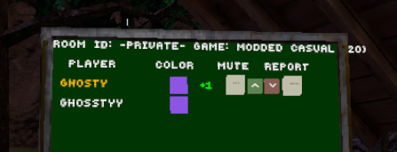

# Votes

The mod adds 3 new things to the leaderboard - a player's "score", and two buttons to either upvote them or downvote them.

Monke being nice and friendly? Give them an **upvote**.

Monke being mean and toxic? Give them a **downvote**.

 
When you join a lobby each monke will have a score next to them, that being their **upvotes** minus their **downvotes**, e.g. +10 or -5

This score is based off of all votes from all monke using this mod.

 
(Also, this mod moves the speaking icon to be on top of the player colour, since I needed somewhere to put the score.)

## IMPORTANT
You may notice in ScoreboardElements.cs that the network request sends your entity token. It's used to verify you are who you say you are, to at least attempt to prevent people spamming votes.

With it I fire the `UpdatePersonalCosmeticsList` cloudscript, since if it succeeds then it proves the entity token provides is indeed valid. I've tested doing so with no issues.

My backend **NEVER** stores your entity token!

### Extra stuff

> What if someone spams votes multiple people?

Kinda bound to happen. There is rate limiting on the backend, so hopefully it won't be *too* bad.

If you're someone planning to mess with the mod's servers or spam votes or anything annoying, please don't :)
